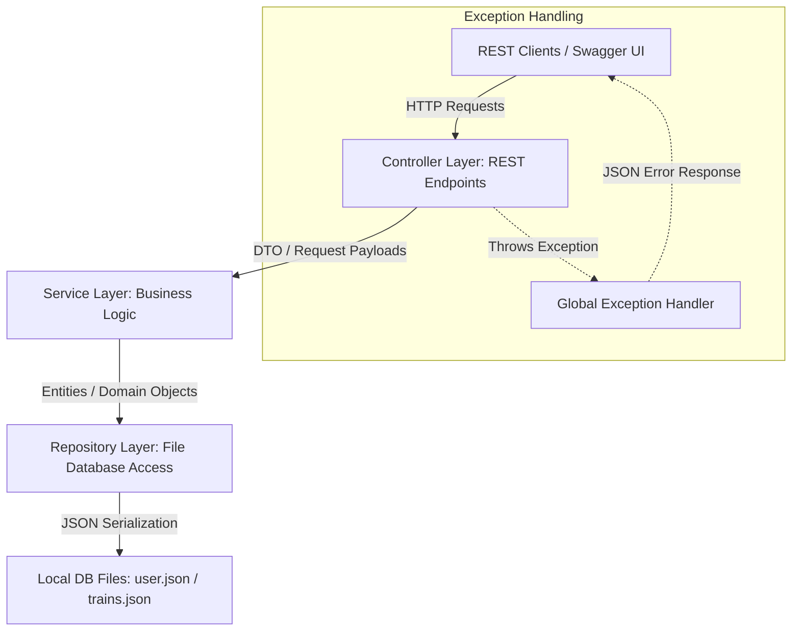

# Booker - Layered Spring Boot Train Booking REST Application

Booker is a robust, layered Spring Boot REST application built on Java 21 and Gradle, designed to handle train scheduling, seat availability inspection, ticket bookings, and cancellations. It features input validation, global exception handling, a JSON-based database persistence layer, and interactive API documentation with Swagger UI.

---

## Features

- **Layered Architecture**: Controller-Service-Repository pattern isolating REST presentation, business logic, and database access.
- **REST Endpoints**: Secure authentication (signup/login) and full train ticket booking lifecycles.
- **Input Validation**: JSR-380 validation constraints on DTO payloads (such as user credential sizes and seat indexes).
- **Global Exception Handling**: Centralized controller advice wrapping business errors, validation failures, and database misses in structured JSON error formats.
- **Automated Testing**: Comprehensive JUnit 5 and Mockito test suites.
- **API Documentation**: Built-in Swagger UI and OpenAPI 3.0 metadata.

---

## Architecture

The application implements a clean **Layered Architecture** (Controller-Service-Repository pattern):



---

## Technology Stack

- **Java**: Version 21 (JDK 21)
- **Framework**: Spring Boot 3.3.0 (Web, Validation)
- **API Documentation**: Springdoc OpenAPI WebMVC UI 2.5.0
- **Security**: jBCrypt (BCrypt password hashing)
- **Build Tool**: Gradle 8.14
- **Testing**: JUnit 5 (Jupiter), Mockito, MockMvc

---

## Repository Structure

```
booker/
├── app/
│   ├── src/
│   │   ├── main/
│   │   │   ├── java/booker/
│   │   │   │   ├── controllers/      # REST API Controllers (Swagger annotated)
│   │   │   │   ├── dtos/             # Validation-annotated request payloads
│   │   │   │   ├── entities/         # Domain model entities (User, Train, Ticket)
│   │   │   │   ├── exceptions/       # Custom Exceptions and ControllerAdvice Handler
│   │   │   │   ├── localDb/          # File Database (user.json, trains.json)
│   │   │   │   ├── repositories/     # Data access layer for JSON file interaction
│   │   │   │   ├── services/         # Business logic layer
│   │   │   │   ├── util/             # Hashing helper utilities
│   │   │   │   └── App.java          # Spring Boot Application Entry Point
│   │   │   └── resources/
│   │   │       └── application.properties # Server port, OpenAPI paths, database files configuration
│   │   └── test/
│   │       └── java/booker/
│   │           ├── controllers/      # MockMvc API endpoint tests
│   │           ├── services/         # Mockito business logic tests
│   │           └── AppTest.java      # Application context loading tests
│   └── build.gradle                  # App Gradle dependencies
├── settings.gradle                   # Gradle project settings
└── README.md                         # Project documentation
```

---

## API Documentation Summary

### Authentication (`/api/v1/auth`)
- **`POST /signup`**: Creates a new user with BCrypt hashed password and random UUID.
- **`POST /login`**: Validates credentials and returns user information.

### Train Operations (`/api/v1/trains`)
- **`GET /search?source={src}&destination={dest}`**: Searches and lists trains traveling in order from `source` to `destination`.
- **`GET /{trainId}`**: Fetches details for a specific train.
- **`GET /{trainId}/seats`**: Retrieves the 2D seat grid (`0` = available, `1` = booked).
- **`POST /{trainId}/book`**: Books a seat on the specified train.
- **`POST /`**: Registers a new train.

### User Operations (`/api/v1/users`)
- **`GET /{username}/bookings`**: Retrieves active ticket bookings for a user.
- **`POST /{username}/bookings/{ticketId}/cancel`**: Cancels a booked ticket and releases the seat.

---

## Setup and Execution

### Prerequisites
- Java JDK 21 installed.
- System path configured with Java binaries.

### Running Tests
Execute the JUnit 5 and Mockito test suites:
```powershell
./gradlew test
```

### Running the Application
Start the Spring Boot web server locally:
```powershell
./gradlew bootRun
```
The application runs on port `8080` by default.

### Accessing API Docs & Swagger UI
When the application is running, open your browser and navigate to:
- **Interactive Documentation**: [http://localhost:8080/swagger-ui/index.html](http://localhost:8080/swagger-ui/index.html)
- **JSON OpenAPI Definition**: [http://localhost:8080/api-docs](http://localhost:8080/api-docs)

---

## Local File Database Config
Database path configurations are defined inside the `app/src/main/resources/application.properties` file:
```properties
booker.db.users-path=app/src/main/java/booker/localDb/user.json
booker.db.trains-path=app/src/main/java/booker/localDb/trains.json
```
Feel free to customize these target paths as required.
